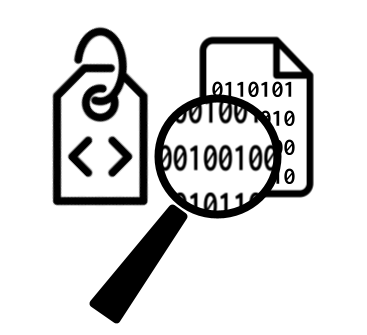

# The Review Process

The review of data and metadata by the EDI Curation Team is an integral part of publishing to the EDI Data Repository as it provides the data author an opportunity to access specific insights on data publishing best practices. Through the review process, EDI curators seek to help finalize a data package submission so that it will be as discoverable, understandable, and reusable as possible.

The review process starts after a [data package](https://docs.google.com/document/d/10lbSR34T_Q6qaZoT6ZqxQoUcBRLy34LUokSFeqhtrXw/edit) is submitted to EDI for publication, and is complete when the data author is satisfied with the proof of their publication and the data are uploaded to the EDI Repository.

[TOC]

## Acknowledgement of submission {#acknowledgement-of-submission}

Acknowledgment of submission will be sent once it has been assigned to an EDI Data Curator. The curator may have some questions regarding the urgency of the publication and if there are any missing components.

## Metadata evaluation {#metadata-evaluation}

The [metadata evaluation](https://docs.google.com/document/d/111fsC4AR1K1jrwlASDDRCu8T7FvPPs3nilT2zCGTLEw/edit?usp=sharing) ensures the data are accurately described. The data curator will perform this analysis and report back issues along with potential solutions, and may offer general suggestions for improving the quality of the data submission.

## Page proofs {#page-proofs}

A proof of the data submission will be provided along with the quality check report. Review the contents thoroughly and share the proof with co-authors if necessary. For a detailed walk through of the proof, see [here](v).

>Tip: Use the [EDI Data Explorer (DeX)](https://docs.google.com/document/d/1ieZDdnFlRo3CgqxExqnuRh3ykM4xCnlKPLOnctsWfAI/edit#heading=h.cdjl8jmbn7ia) to identify potential issues in data values before publishing. A link to DeX is provided next to data tables listed in the [resources section](https://docs.google.com/document/d/1fYIJAKFaA4lPyqo6Rz0ZSEUKKiNMLF5UZCxlyUfhxwM/edit#heading=h.1wijcfxy5kjg) of the data package summary page.

## Revise {#revise}

Work with the EDI curator to implement requested changes, suggested improvements, and any other addition or change to a data submission.

## Re-Submit {#re-submit}

Submit the revision. The data curator will rerun the metadata evaluation check, update the page proofs, and send back for consideration. This process may repeat.

## Publish {#publish}

When happy with the proof, let the curator know that the data submission is ready to be published. The curator will assign a DOI and publish the data package.

>To facilitate citation and reproducible research, any future changes to a published data package will be archived as a revision and assigned a new DOI. For more on creating a revision see [here](https://docs.google.com/document/d/1OfT_XMpTbRhJNSMWMC7wcsNm71m2KOYEibEgW15rUew/edit?usp=sharing).
